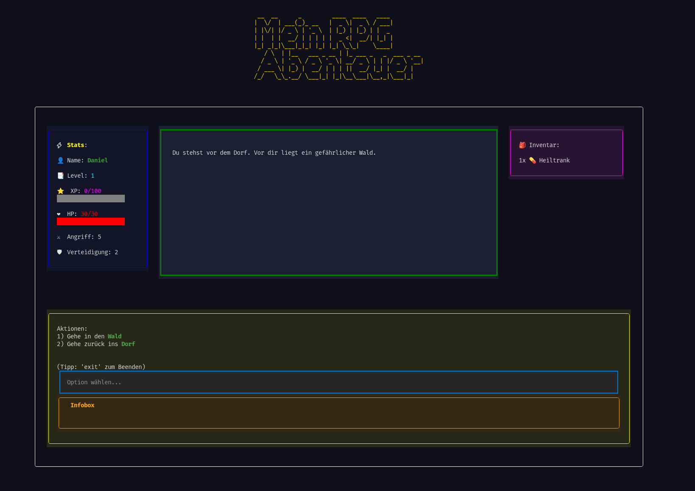

# RPG Spiel Terminal User Interface

## Was ist das hier genau?
Dies hier ist mein kleines aber feines RPG Spiel in einem Terminal User Interface Gewand. Ich hab es erstellt um die Nutzung der Python Bibliothek "textual" zu lernen und die praktische Nutzung zu trainieren.

## Wie ist der aktuelle Stand?
Aktuell ist es mehr eine Basis. Da noch nicht alle benötigten Spielmechaniken eingebaut wurden.
Der Fokus dieses Projektes liegt für mich mehr darauf wie man etwas grafisch in einem Terminal darstellen kann.

> Für Fragen zu diesem Projekt stehe ich wie immer jederzeit gerne zur Verfügung.

---

